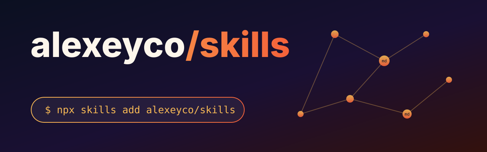

# skills

[](https://skills.sh/alexeyco/skills)

Personal collection of [Agent Skills](https://agentskills.io): self-contained skill directories that spec-compliant clients discover and load.

## Skills

### [docmap](skills/docmap/SKILL.md)

Makes repository documentation worth reading: every document has one role and one consumer, every fact keeps a single source of truth, and sections cross-reference instead of repeating. Ships with an audit that proves links resolve and root docs exist.

```bash
npx skills add alexeyco/skills --skill docmap
```

## License

MIT - see [LICENSE](LICENSE).

## Development

Agents and humans follow [AGENTS.md](AGENTS.md); verification is a single `make check`.
